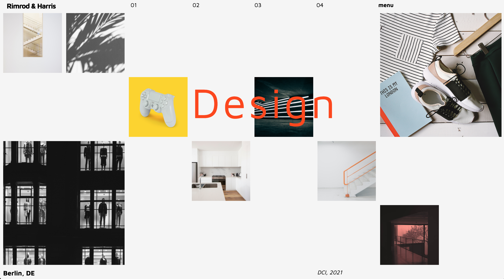

# Grid Design Studio

Du wurdest gerade damit beauftragt, die neue Homepage für _Romrod & Harris_ Design zu erstellen. Unten gibt es das Modell von der Website, das der Desginer dir geschickt hat -

Sieht aus wie ein Job für **CSS Grid**, ne?

#### Einleitungen

> - Verwende die Schriftart _Maven Pro_ von **Google Fonts**
> - Im Moment mache keine Sorge über die Responsivität - konzentriere dich nur auf dem Desktop-Layout
> - Alle Bilder befinden sich in dem **Assets** Verzeichnis
> - Es gibt viele Arte, wie man das erreichen kann! Ein verschachteltes Grid wäre nutzvoll..
> - So 'Pixel Perfect' wie möglich :)
